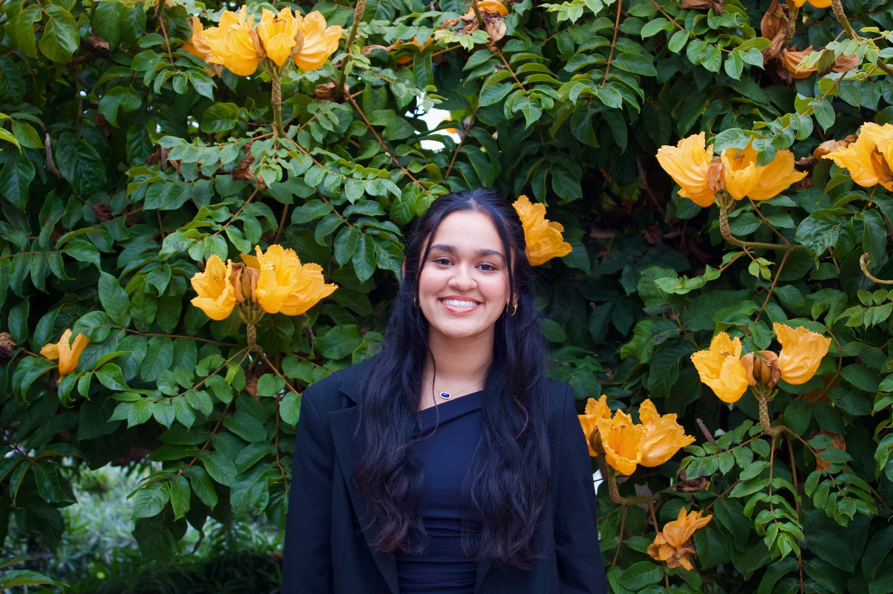

# Arpita Pandey 

<!-- SECTION LINKS: Table of Contents linking to headers in this file -->
- [About Me](#about-me)
- [Skills](#skills)
- [Contact](#contact)

---

## About Me

<!-- PICTURE: Replace with your own image path or URL -->


<!-- STYLING TEXT: bold, italic, bold+italic, strikethrough -->
Hi! I'm **Arpita Pandey**, a _Mathematics and Computer Science Student_ at ***UC San
Diego***. I enjoy ~~procrastinating~~ building things that solve real problems.I'm
very involved on campus as the VP External of Women in Computing at UCSD and a
researcher at the Programming Systems Lab! This summer I'll be interning at Versana
where I'm really excited to work on their syndicated loan platform! In my free time
I love working out, especially pilates, playing volleyball, adding a new food spot
to my Beli, and hanging with friends!

<!-- QUOTING TEXT -->
> "I dwell in possibility." – Emily Dickinson, Poet

---

## Skills

<!-- ORDERED LIST -->
**Languages I'm learning (in order of confidence):**

1. Java
2. Python
3. C++
4. JavaScript
5. C
5. HTML/CSS


<!-- UNORDERED LIST -->
**Tools & Technologies:**

- Git & GitHub
- VS Code
- Linux 
- Docker
- React 
- React Native 
- Pandas 
- SQL
- Node.js 
- REST APIs 

<!-- QUOTING CODE: inline and fenced block -->
I love using `print()` to debug.

Here's a snippet of python code:

```python
def greet(name):
    """Return a personalized greeting."""
    return f"Hello, {name}! Welcome to my page."
```

---


<!-- TASK LIST -->
### TO DO List

- [x] Set up GitHub Pages
- [x] Create index.md
- [ ] Write detailed project READMEs

---


---

## Contact
<!-- RELATIVE LINK to an image file, encoded as a regular link (not an image) -->
Here is the [raw version of my profile photo](profile.JPG).


- **GitHub:** [arpita-pandey](https://github.com/yourusername)
- **Email:** a4pandey@ucsd.edu
- **LinkedIn:**  [arpitapandey13](https://www.linkedin.com/in/arpitapandey13/)